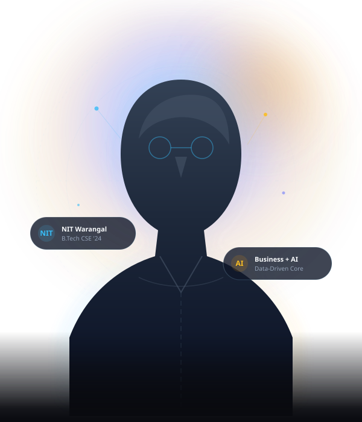

# Roopesh Mamidala — Personal Portfolio Website

A modern, premium personal portfolio website engineered for **Roopesh Mamidala**, Computer Science graduate from the **National Institute of Technology, Warangal (B.Tech CSE, 2024)**.

The website positions Roopesh distinctly at the intersection of:
**Business • Data • Technology • AI**

---

## 🎨 Design Philosophy & Features

- **Reference-Inspired Editorial Aesthetic**: Adapts the high-contrast magazine layout, bold grotesque typography, elegant serif italic accents, and ambient radial glow from the reference design into a sophisticated dark-mode palette (`#080a0f`).
- **Target Audience**: Tailored for recruiters, hiring managers, and strategic partners seeking candidates who combine deep computational fundamentals with business analytics and AI capability.
- **Glassmorphic Cards**: Restrained transparency (`backdrop-filter: blur(16px)`), fine borders (`rgba(255, 255, 255, 0.08)`), and subtle ambient lighting.
- **Interactive Capabilities**:
  - **Dynamic Scroll-Spy Navigation**: Automatically tracks and highlights the active section as you scroll.
  - **Expandable Project Modal**: Detailed architectural breakdowns for all projects with diagrammatic previews.
  - **Interactive Skills Filter**: Instant discipline filtering across Programming, Data & Analytics, Data Architecture, Business Consulting, and Web.
  - **One-Click Email Copy**: Direct copy-to-clipboard button with visual toast confirmation.
  - **Contact Message Simulation**: Interactive submission with instant client-side feedback.
  - **Responsive Mobile Navigation**: Clean slide-down glass drawer for phone and tablet viewports.

---

## 📂 Project Structure

```
roopesh-mamidala-portfolio/
├── index.html                  # Core single-page portfolio layout with 8+ sections
├── css/
│   ├── style.css               # Dark theme variables, glassmorphism, responsive styles
│   └── animations.css          # Ambient glowing, subtle floats, scroll reveal keyframes
├── js/
│   ├── data.js                 # Structured project data and comprehensive modal descriptions
│   └── main.js                 # Scroll-spy, mobile menu, filter tabs, modal dialog, toast
├── assets/
│   └── images/
│       ├── roopesh-avatar.svg      # Hero portrait visual with tech coordinate accents
│       ├── rag-architecture.svg    # RAG Project architecture flow diagram
│       ├── blockchain-system.svg   # Blockchain decentralized asset verification graphic
│       ├── vision-ai.svg           # Computer vision emotion classification reticle
│       └── compression-tree.svg    # Huffman binary prefix tree optimization graphic
└── README.md
```

---

## 🚀 How to Preview & Run

### Method 1: Direct File Opening
Double-click `index.html` in your file explorer or open it in any modern browser (Chrome, Edge, Firefox, Safari).

### Method 2: Local HTTP Server (Recommended)
Using Python from terminal:
```powershell
cd C:\Users\HOMEE\.gemini\antigravity\scratch\roopesh-mamidala-portfolio
python -m http.server 8080
```
Then visit `http://localhost:8080` in your web browser.

---

## 👤 Customizing the Profile Photo
To use an actual photograph instead of the tech avatar illustration:
1. Place your portrait image in `assets/images/roopesh.jpg` (or `.png`).
2. Open `index.html` and replace line ~119:
   ```html
   
   ```
   with:
   ```html
   
   ```
The ambient backlight aura behind the image container will automatically frame your photo with the signature glowing halo.
